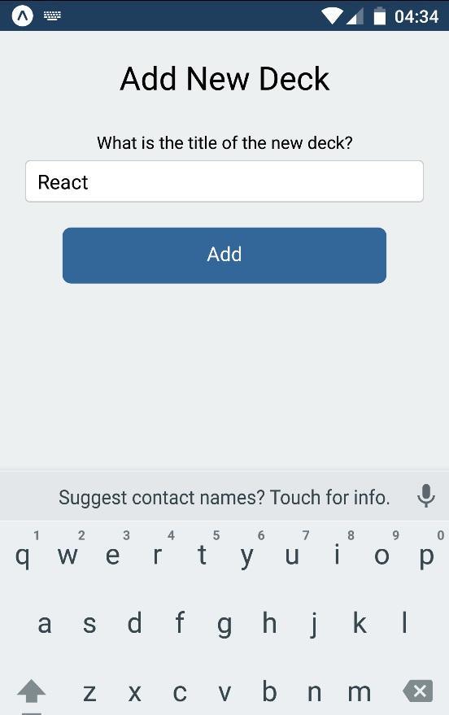
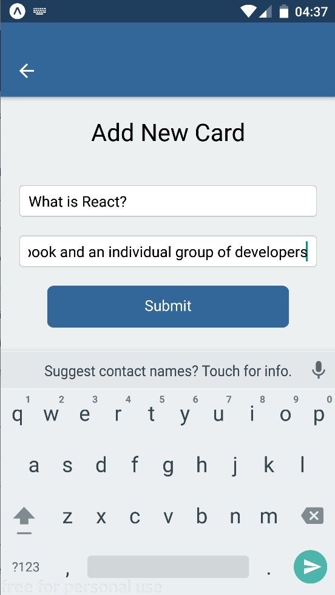
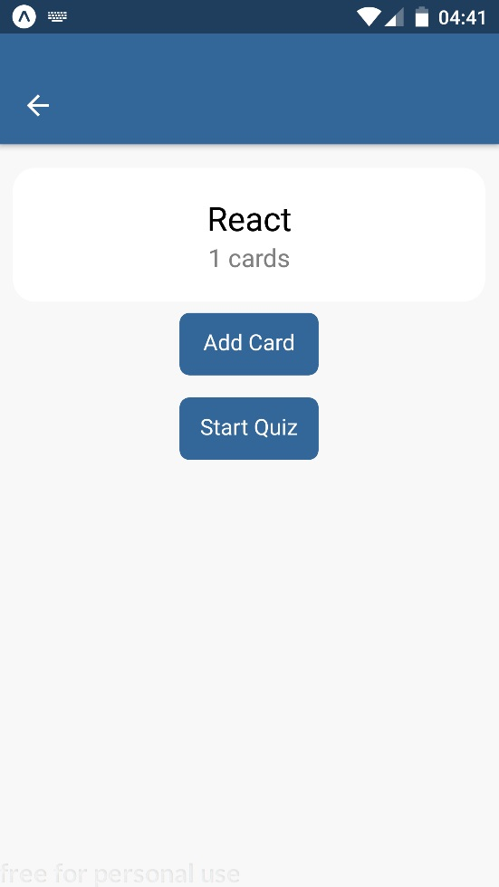
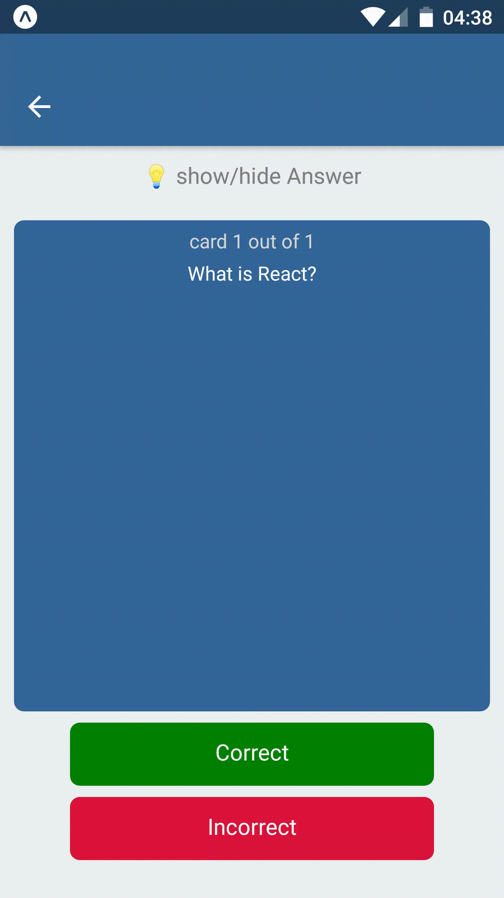

# MobileFlashcards

It's a project for Udacity's React Fundamentals course.

## Getting Start
- The application has been tested on Android platform
- The application requires only yarn install and yarn start to install and launch. npm can be used in place of yarn.

#### New Deck

#### Add Card to deck

#### Deck view

#### hide/show answer in quiz

